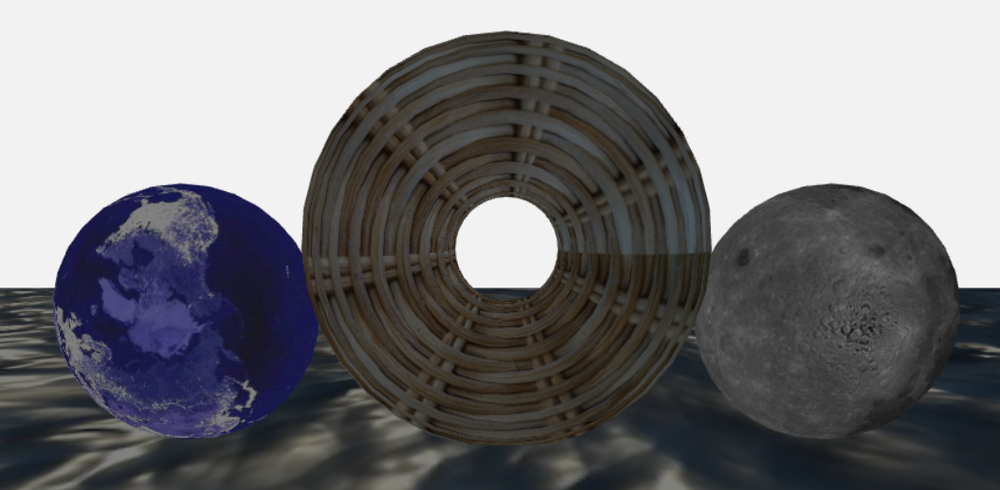
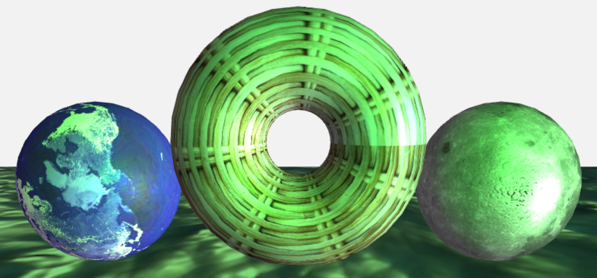
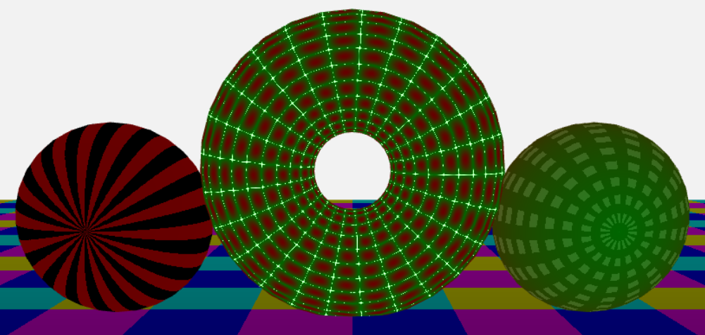
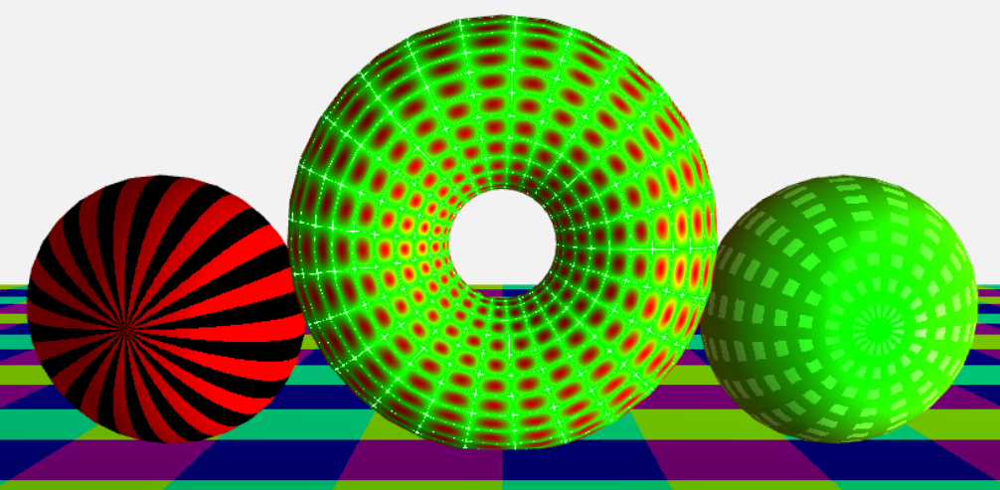

---

**Graphical Visualisation Technologies**

**Dozent: Prof. Dr. Felix Gers (Berliner Hochschule für Technik)**

**Studiengang Medieninformatik Online MA, Wintersemester 2022/23**

**University of Applied Sciences Emden/Leer, Faculty of Technology, Department of Electrical Engineering and
Informatics**

---

### Einsendeaufgabe EA9 - Torustextur

[zur Webseite](https://gvt.ckitte.de/ea9/)

Im Rahmen der neunten Einsendeaufgabe soll ein Torus mit einer Bildtextur sowie als Erweiterung mit einer prozedural erstellten Textur erstellt werden. Als Interaktion soll sich die Kamera über die Pfeil- und WASD-Tasten bewegen lassen. Die vorliegende Umsetzung basiert auf der [EA 8](https://github.com/ChristianKitte/GvtBeleuchtung) und somit im Kern auf den Sourcecode des Kursmoduls. 

Die folgenden Abbildung zeigt die möglichen Interaktionen:

Über die ***Pfeiltasten (1)*** kann die Kamera um das Modell bewegt werden. Zudem kann über die Tasten ***w, s, a, d (2)*** eine Bewegung auf den Achsen erfolgen. 

Wie bereits in der EA 8, wurde auch in dieser Abgabe eine Beleuchtung umgesetzt. Um die vorhandenen Farben vor allem bei den Texturen nicht zu sehr zu verfälschen, wurde hier eine ***grünes*** sowie ***weißes*** ***Punktlicht*** genutzt. Zudem existiert eine ***neutrales*** ***Umgebungslicht***.

Über eine ***Dropdownbox (4)*** können die Punktlichter ein- und ausgeschaltet werden. Das Umgebungslicht bleibt hierbei immer aktiv.

Über die ***Tasten l und L  (3)*** laufen die Punktlichter analog zur EA 8 in einer Kreisbahn um das Modell. Hierbei werden die Punktlichter eingeschaltet, sofern dies noch nicht geschehen ist. 

Die Textur kann mit der ***Dropdownbox (5)*** geändert werden. Hierbei kann zwischen einer Bildtextur, der prozeduralen Textur sowie der ursprünglichen Farbe aus der EA 8 umgeschaltet werden. 

http://www.planetaryvisions.com/Texture_map.php?pid=213  moon  
https://math.hws.edu/graphicsbook/source/webgl/textures/NightEarth-512x256.jpg   nightearth  
https://catlikecoding.com/unity/tutorials/flow/texture-distortion/tutorial-image.jpg  water  
https://upload.wikimedia.org/wikipedia/commons/e/e6/PSM_V69_D182_Small_magellanic_cloud_and_its_variable_stars.png  stars  
https://2.bp.blogspot.com/-xWw3zjL4Ukc/XDtC9g5k3PI/AAAAAAAAOKM/-O2XthNOxQ8xKUd9wT9tXNVXtx1mJMU0QCEwYBhgL/s1600/DSC06233.JPG

Als ***Bildtextur*** der ersten Kugel dient hierbei eine [***Welttextur***](https://math.hws.edu/graphicsbook/source/webgl/textures/NightEarth-512x256.jpg), welche die Erde bei Nacht und die vorhandene Beleuchtung zeigt. Für die zweite Kugel wurde eine [***Mondtextur***]([Moon texture map](http://www.planetaryvisions.com/Texture_map.php?pid=213)) verwendet. Für den eigentlich geforderten Torus wurde eine [***Textur auf Basis eines geflechteten Korbes***](https://2.bp.blogspot.com/-xWw3zjL4Ukc/XDtC9g5k3PI/AAAAAAAAOKM/-O2XthNOxQ8xKUd9wT9tXNVXtx1mJMU0QCEwYBhgL/s1600/DSC06233.JPG) verwendet. Der Untergrund wurde mit einer [***Wassertextur***](https://catlikecoding.com/unity/tutorials/flow/texture-distortion/tutorial-image.jpg) versehen:

*(ohne Licht)*

*(mit Licht)*

Für die prozedurale Textur wurden verschiedene Variationen ausprobiert und auf die vier unterschiedlichen Modelle angewendet. Die Fallunterscheidung und Umsetzung erfolgt hierbei innerhalb der ***Fragment Shaders*** und wird auf den ***Scriptseite*** dem Modell als ***numerischer Code*** mitgegeben:

*(ohne Licht)*

*(mit Licht)*

### Aufteilung des Codes

Das für den Code aus der EA 8 gesagte gilt in weiten Teilen auch für diesen Code. So enthält der Code zu einem großen Teil Code den Musterprogramms aus der Lerneinheit Beleuchtung, welcher jedoch in weiten Teilen angepasst und erweitert wurde. 

Die Animation der Beleuchtung wird wenn nötig wieder mit Hilfe der Funktion ***rotate*** und  ***RequestAnimationFrame*** umgesetzt.

Die Entscheidung, ob eine Translation berechnet und angewendet wird, erfolgt auf Grundlage der Variablen ***animate***. Diese wird in Abhängigkeit von der Betätigung der ***L-Taste*** jeweils umgeschaltet. Die Entscheidung, ob ***Punktlichter*** berücksichtigt werden, erfolgt über die Variable ***lightOn***. Die Variable ***textureTyp*** entscheidet, welcher Algorithmus für die ***prozedurale Textur*** angewendet wird. Grundsätzlich wird die Textur selbst dem Modell mitgegeben und später an den Vertexshader übergeben.

Die Berechnung der neuen Position der Punktlichter findet in der Funktion ***updateTransformation*** statt. Hierzu werden lediglich die Koordinaten der Punktleuchten verändert. Notwendige Translationen zu deren Anzeige sind bereits im Musterprogramm vorhanden.

Die ***Bilder der Texturen*** werden analog zum Vorgehen im Modul während der Initialisierung der Modelle ***asynchron geladen***. Die Steuerung der ***Programmlogik*** erfolgt mittels der ***übergebener Variablen und Werte an die Shader***.

Beide ***Shaderdateien*** werden als ***separate Dateien*** [fshader.frag](https://github.com/ChristianKitte/GvtTorustextur/blob/main/shaders/fshader.frag) und [vshader.vert](https://github.com/ChristianKitte/GvtTorustextur/blob/main/shaders/vshader.vert) gehalten und bei Programmstart geladen. Dies ermöglicht eine Syntaxkontrolle innerhalb der IDE (Webstorm mit GLSL Plugin).

Die Datei **main.css** enthält alle benötigten Klassen, um die Grafik einfach einzubinden. In der Datei **layout.css** wird das Layout der Webseite selbst festgelegt. Daneben kommt Bootstrap für die Buttons zum Einsatz.
